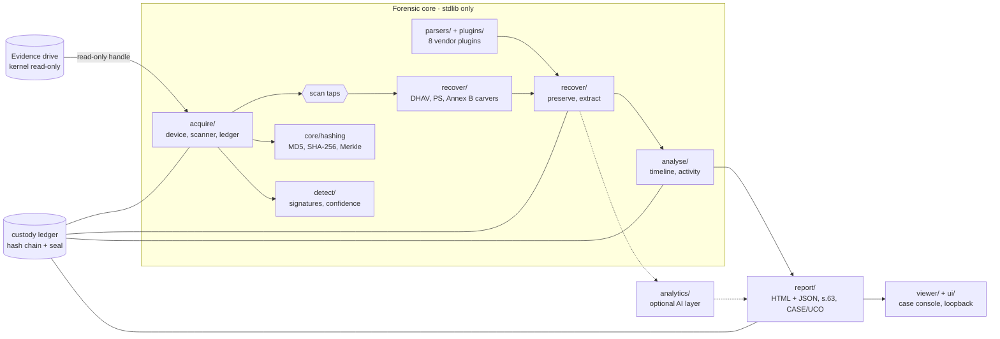

Forensics Toolkit — Multi-Vendor DVR/NVR Forensic Analysis

**Standardized Acquisition, Recovery and Analysis of Surveillance Evidence across DVR/NVR Vendors**

<!-- TODO: replace DEMO_VIDEO_URL and DECK_PDF_URL, or delete those two badges -->
[](https://www.sih.gov.in/)
[](docs/PROBLEM_STATEMENT.md)
[](https://github.com/victorysingh/dvr-forensics-toolkit/actions/workflows/tests.yml)
[](docs/TECH_STACK.md)
[](DEMO_VIDEO_URL)
[](DECK_PDF_URL)

> **A vendor-agnostic DVR/NVR forensic tool that reads a surveillance drive once, read-only, and in that one pass hashes it, identifies the recorder, and recovers footage the recorder's own index no longer lists. Every vendor claim carries a status set by its weakest evidence, and every action lands in a hash-chained custody ledger.**

**Smart India Hackathon 2026 · SIH26150 · NTRO · Blockchain & Cybersecurity · Team Chronicles.exe (178295)**

   


The case console on two real drives: (1) all eight PS vendors, each with its status; (2) the pipeline from acquisition to report; (3) 2,246 recordings recovered from outside the index; (4) people and faces detected in recovered footage; (5) AI triage, leads never called evidence; (6) court exports: BSA s.63, CASE/UCO, NIST.

---

## The problem

Eight major OEMs (Dahua, CP Plus, Honeywell, Hikvision, TP-Link, Godrej, Uniview, Matrix) each store video in their **own proprietary filesystem**. General forensic tools cannot read them, and each vendor's software reads only its own format.

The disks are also big and slow. A **1 TB** recorder drive over a USB 2 bridge takes **~11.3 h to read once**. Run each task (hash, detect, carve, profile) as its own read and that becomes **~56.6 h**; image the drive first and you need **~931 GiB** of free space before you start.

And the footage that matters most is often the footage the recorder has **forgotten**: overwritten index entries, or a whole drive reformatted by a different recorder. Plug it into Windows and it will offer to format the disk, because it recognises no filesystem on it.

## How the toolkit solves it

One read-only pass does the work of five, and recovery does not depend on the index:

| Vendor | How we read it | Status |
| --- | --- | --- |
| Dahua / CP Plus | DHFS 4.1 parser + indexless DHAV carver | real media (drive 1), `spec_only` |
| Hikvision | HIKBTREE index records + MPEG-PS carver | real media (drive 2), `spec_only` |
| HeimVision *(other platform)* | plugin built from the NIST CFReDS image | real public image, `spec_only` |
| Honeywell | plugin from Yoon & Hwang, DFRWS USA 2026 | `spec_only` |
| Uniview | from its firmware's storage driver | `spec_only` |
| Godrej | from Qualvision's firmware | `spec_only` |
| Matrix | from its own documents | `spec_only` |
| TP-Link | index read from its firmware | `detected_not_parsed` |
| Any other vendor | raw H.264/H.265 carver, no parser needed | `synthetic_only` |

**The honesty rule:** `validated` (byte-matched to the recorder's own export) › `spec_only` (from research, firmware or documents) › `detected_not_parsed` › `synthetic_only`. The weakest piece of evidence sets the status, and this is enforced in code (`detect/engine.py::_weakest`), not only in prose.

- **Never writes to the evidence drive:** there is no write path in `acquire/device.py`, not behind a flag, not behind a confirmation. Write blocking is layered (kernel `setro`, udev rule, read-only handle) and the report states it is a *software* block.
- **Single pass:** whole-drive MD5 + SHA-256, per-block SHA-256, vendor signatures, codec profile and all three carvers in one traversal, each tap in its own process.
- **Block map + Merkle root, not one hash:** resumable acquisition, per-clip inclusion proofs, and tamper *localisation* to the 8 MiB block.
- **Bad sectors zero-filled in place, never skipped**, so no downstream offset shifts; a USB drop is detected as a lost device, not as bad sectors, and the pass resumes only after re-verifying the drive.
- **Confidence, not yes/no:** CP Plus boards are often Dahua rebadges, so vendor attribution is scored from weighted signatures.
- **A timeline that refuses to invent a time zone:** recorder clock → UTC only on stated inputs; gaps and silences cross-checked against the recorder's own log.
- **Hash-chained custody ledger**, HMAC-sealed with a key kept outside the case folder, so an edited, removed or rewritten entry is caught.
- **Court-ready outputs:** HTML + JSON report, a draft **BSA 2023 s.63** certificate, CASE/UCO JSON-LD, and NIST's CCTV profile (NISTIR 8161).
- **AI in the loop, as leads:** people, vehicles, faces and face search on recovered footage, every model pinned by SHA-256, every result labelled *a lead, not evidence*.

## Results

Measured on two real 1 TB surveillance drives the team acquired, and on NIST's public HeimVision image.

| What | Result |
| --- | --- |
| Drive 1, CP Plus (Dahua DHFS 4.1) | 2,029 indexed recordings + **2,246 streams (5.4 GB) recovered from outside every index** |
| Drive 2, reformatted by a Dahua-family recorder | **2,516 Hikvision streams (923 GiB, ~6,300 h)** recovered and dated from under the reformat |
| Camera attribution, drive 2 | 2,021 streams put on a camera from surviving index records; the carve covers **99.6–99.7%** of what the index recorded |
| Second implementation | ffmpeg's own `dhav` reader agrees on **all 719,097** video frames from drive 1's carved streams |
| Real Dahua `.dav` files | **726 of 726** and **104 of 104** frames identical to ffmpeg |
| NIST CFReDS HeimVision (150 GB E01) | our E01 reader reproduces **FTK Imager's MD5 and SHA-1**; 24 h on 4 cameras recovered from a recorder we had never seen |
| Event correlation | **16 of 17** all-camera silences explained by power cuts in the recorder's own log |
| Analysis time, 1 TB over USB 2 | **~11.3 h** one pass vs ~56.6 h one read per task vs ~21.9 h image-first (+ ~931 GiB free) |
| Hostile input | **12,800** damaged disks, streams and E01 sets: no crash, no hang (after fixing the 144 crashes and 1 hang they found) |
| People in real recorder frames | **44 of 57** labelled frames (first version: 0); **810 of 1,089** people on held-out CAVIAR footage |
| Face search by photo | on LFW faces made recorder-sized: same person passes in **97.8%** of pairs (eyes ≥ 12 px), **no** pair of different people passes; on real footage, **1** false candidate (an upside-down head at a fisheye's edge) |
| Regression suite | **580 tests** (582 with ffmpeg), no hardware, on Linux and Windows CI |

Nothing is `validated` yet: that needs a byte-match between recovered footage and the recorder's own export (`validate-export`), not yet run on a real export. Every number's source is in [`docs/VALIDATION_REPORT.md`](docs/VALIDATION_REPORT.md) and [`docs/STATUS.md`](docs/STATUS.md).

---

## Architecture

<!-- TODO: optional architecture image, e.g. [](assets/dvr-architecture.png) -->



## Methodology

```mermaid
flowchart LR
  %% DVR Forensics Toolkit — PS26150 pipeline
  subgraph IN["01 · INPUT"]
    direction TB
    DRIVE[("DVR/NVR drive")]
    E01["E01 or raw image"]
    UNIT["Recorder unit<br/>label + photos"]
  end

  subgraph SAFE["02 · EVIDENCE SAFETY"]
    direction TB
    WB["Software write-block<br/>setro + udev + RO handle"]
    RO["Read-only<br/>device layer"]
    BAD["Bad sectors<br/>zero-filled in place"]
    RECON["Verified reconnect<br/>after USB drop"]
  end

  subgraph PASS["03 · SINGLE PASS"]
    direction TB
    HASH["MD5 + SHA-256"]
    MERKLE["Per-block SHA-256<br/>Merkle root"]
    SIG["Vendor signatures"]
    CODEC["Codec + entropy<br/>profile"]
    TAPS{{"Scan taps<br/>one process each"}}
  end

  subgraph ID["04 · IDENTIFICATION"]
    direction TB
    SCORE{{"Confidence<br/>scoring"}}
    MODEL["Model strings<br/>vs unit label"]
    SURVEY["Unknown-vendor<br/>survey"]
    STATUS["Status by<br/>weakest evidence"]
  end

  subgraph REC["05 · PARSING + RECOVERY"]
    direction TB
    PLUG[["8 vendor plugins<br/>one SDK"]]
    DHAV["DHAV carver"]
    PSC["MPEG-PS carver"]
    ANNEXB["Raw H.264/H.265<br/>carver"]
    HIKB["Index records<br/>to cameras"]
    PRES["Metadata preserved<br/>provable to root"]
  end

  subgraph TL["06 · TIMELINE"]
    direction TB
    CLOCK["Recorder clock to UTC<br/>on stated inputs"]
    GAPS["Gaps per camera"]
    LOG["Recorder's own log"]
    CORR["Cross-camera<br/>correlation"]
    ACT["Motion from<br/>frame sizes"]
  end

  subgraph AIL["07 · AI LEADS · OPTIONAL"]
    direction TB
    YOLO["YOLOX-S<br/>people, vehicles"]
    YUNET["YuNet faces"]
    SFACE["SFace<br/>face search"]
    OSD["OSD OCR<br/>title + clock"]
  end

  subgraph OUT["08 · CUSTODY + OUTPUT"]
    direction TB
    LEDGER[("Hash-chained ledger<br/>HMAC-sealed")]
    REPORT["HTML + JSON report"]
    S63["BSA s.63<br/>certificate"]
    UCO["CASE/UCO JSON-LD<br/>NISTIR 8161"]
    CONSOLE["Case console"]
    PROOF{"verify / prove<br/>inclusion proofs"}
  end

  DRIVE --> WB --> RO
  E01 --> RO
  RO --> BAD --> RECON
  RECON ==> HASH & MERKLE & SIG & CODEC & TAPS

  SIG --> SCORE --> STATUS
  UNIT --> MODEL --> STATUS
  SIG --> SURVEY --> STATUS

  STATUS --> PLUG
  TAPS --> DHAV & PSC & ANNEXB
  PLUG --> HIKB
  HIKB --> PSC
  PLUG --> PRES
  MERKLE --> PRES

  DHAV & PSC & ANNEXB --> GAPS
  PLUG --> CLOCK --> GAPS --> CORR
  LOG --> CORR
  TAPS --> ACT --> CORR

  DHAV & PSC -. extracted clips .-> YOLO & YUNET & OSD
  YUNET --> SFACE

  CORR --> REPORT
  YOLO & SFACE & OSD -. leads .-> REPORT
  REPORT --> S63 & UCO & CONSOLE
  MERKLE --> PROOF
  HASH & PRES & REPORT -.-> LEDGER
  LEDGER --> PROOF

  classDef input fill:#ecfeff,stroke:#22d3ee,stroke-width:1.5px,color:#164e63;
  classDef safety fill:#fff1f2,stroke:#fb7185,stroke-width:2px,color:#881337;
  classDef pass fill:#f5f3ff,stroke:#a78bfa,stroke-width:2px,color:#4c1d95;
  classDef innovation fill:#eef2ff,stroke:#818cf8,stroke-width:4px,color:#312e81;
  classDef ident fill:#fdf4ff,stroke:#e879f9,stroke-width:1.5px,color:#701a75;
  classDef recover fill:#f0fdfa,stroke:#2dd4bf,stroke-width:1.5px,color:#134e4a;
  classDef timeline fill:#fff7ed,stroke:#fb923c,stroke-width:1.5px,color:#7c2d12;
  classDef ai fill:#fefce8,stroke:#facc15,stroke-width:1.5px,color:#713f12;
  classDef output fill:#f0fdf4,stroke:#4ade80,stroke-width:1.5px,color:#14532d;

  class DRIVE,E01,UNIT input;
  class WB,RO,BAD,RECON safety;
  class HASH,SIG,CODEC pass;
  class MERKLE,TAPS innovation;
  class SCORE,MODEL,SURVEY,STATUS ident;
  class PLUG,DHAV,PSC,ANNEXB,HIKB,PRES recover;
  class CLOCK,GAPS,LOG,CORR,ACT timeline;
  class YOLO,YUNET,SFACE,OSD ai;
  class LEDGER,REPORT,S63,UCO,CONSOLE,PROOF output;
```



---

## Quick start

The forensic core has **zero dependencies**: a bare Python 3.11+ install on an air-gapped workstation is enough.

```bash
git clone https://github.com/victorysingh/dvr-forensics-toolkit.git
cd dvr-forensics-toolkit

python tests/test_pipeline.py       # 580 tests (582 with ffmpeg), no hardware
python demo/stage_demo.py           # every capability in eight steps, ~5 s, synthetic disks
python cli.py serve                 # case console on http://127.0.0.1:8150
```

**On a real drive** (full procedure: `docs/LINUX_ACQUISITION.md`, `docs/SOP_EXAMINATION.md`):

> ⚠️ Write-block before the device node is touched (`sudo blockdev --setro /dev/sdX`, then `blockdev --getro` must print `1`). Raw reads need Administrator/root. **If Windows offers to format the disk, always click Cancel**: a DVR platter has no filesystem Windows recognises, and accepting destroys the evidence.

```bash
python cli.py devices                                   # list attached drives (read-only)
python cli.py writeblock-rule --device /dev/sdb --user "$USER"   # stay read-only across reconnects
python cli.py scan --device /dev/sdb --case CASE-001 --investigator "NAME" \
                   --carve --carve-ps --reconnect-wait 480        # one pass: hashes + both carvers
python cli.py parse          --device /dev/sdb --vendor Dahua --out out/CASE-001
python cli.py extract-carved --device /dev/sdb --out out/CASE-001  # recovered footage out, hashed
python cli.py timeline       --out out/CASE-001 --tz-offset 330
python cli.py certificate    --out out/CASE-001 --part A          # BSA 2023 s.63, drafted from the case
python cli.py report         --out out/CASE-001                   # HTML + JSON, hashed into the ledger
python cli.py verify         --out out/CASE-001                   # re-verify custody, Merkle root, blocks
```

Any command also takes an `.E01` image in place of a device. The full command list is in `docs/USER_MANUAL.md`.

**Demo scenes** (synthetic disks, not evidence):

```bash
python demo/stage_demo.py           # the whole pipeline in eight steps
python demo/tamper_demo.py          # tamper detection, localised to the block
python demo/bench_single_pass.py    # one pass vs one read per task (docs/PERFORMANCE.md)
```

**Windows, no Python:** one packaged `ps26150-dvr.exe` (~11 MB) with the core, every plugin and the console. See [`packaging/README.md`](packaging/README.md).

**AI layer (optional):** runs from its own environment and never touches acquisition. `pip install -r analytics/requirements.txt`, then `python analytics/fetch_models.py` (models checked against pinned SHA-256). See [`analytics/README.md`](analytics/README.md).

## Tech stack

Python 3.11+ (stdlib-only forensic core) · Kaitai Struct (`.ksy` format definitions) · ffmpeg · ONNX Runtime (YOLOX-S, YuNet, SFace) · React + Vite + Tailwind (case console) · PyInstaller · GitHub Actions (Linux + Windows)

## Repository layout

```
core/        frozen data contract, streaming hashes, Merkle tree + inclusion proofs
acquire/     read-only device layer, single-pass scanner, E01 reader, custody ledger
detect/      vendor signatures, confidence scoring, model identification, unknown-vendor survey
parsers/     Dahua DHFS, Hikvision (HIKBTREE, system log), ext2/ext3
plugins/     drop-in vendor plugins: HeimVision, Honeywell, Uniview, Godrej, Matrix, TP-Link, template
recover/     DHAV, MPEG-PS and raw H.264/H.265 carvers, metadata preservation
analyse/     timeline, gaps, cross-camera correlation, motion activity, clock from daylight
analytics/   optional AI layer: detection, face search, OSD OCR (leads, not evidence)
report/      HTML + JSON report, BSA s.63 certificate, CASE/UCO, NIST CCTV export
validate/    real-media checks, export byte-match, fuzzing, ffmpeg cross-checks
formats/     Kaitai Struct definitions of the vendor formats
viewer/ ui/  case console (stdlib server + React build)
tests/       580 regression tests and synthetic DVR disk generators
demo/        stage, tamper and single-pass benchmark demos
packaging/   single-file executable build
docs/        architecture, SOPs, validation, OEM comparison, final report
```

## Documentation

Every PS26150 deliverable, one file each:

| Deliverable | File |
| --- | --- |
| Comparative analysis of OEMs | [`docs/OEM_COMPARISON.md`](docs/OEM_COMPARISON.md) |
| DVR/NVR forensic image | [`docs/FORENSIC_IMAGE.md`](docs/FORENSIC_IMAGE.md) |
| System architecture | [`docs/ARCHITECTURE.md`](docs/ARCHITECTURE.md) |
| Standard Operating Procedures | [`docs/SOP_EXAMINATION.md`](docs/SOP_EXAMINATION.md), [`docs/LINUX_ACQUISITION.md`](docs/LINUX_ACQUISITION.md) |
| Validation report | [`docs/VALIDATION_REPORT.md`](docs/VALIDATION_REPORT.md) |
| User manual | [`docs/USER_MANUAL.md`](docs/USER_MANUAL.md) |
| Final project report | [`docs/FINAL_REPORT.md`](docs/FINAL_REPORT.md) |
| Research basis and differentiators | [`docs/RESEARCH_BASIS.md`](docs/RESEARCH_BASIS.md) |
| Analysis time | [`docs/PERFORMANCE.md`](docs/PERFORMANCE.md) |
| Status against the PS, item by item | [`docs/STATUS.md`](docs/STATUS.md) |

We build on published prior art (Yoon & Hwang 2026, Rzayeva et al., Dragonas et al., SWGDE) and on NIST CFReDS' public DVR image. Our claim is the combination: one read-only pass, indexless recovery proven on real field drives, a status on every vendor claim set by its weakest evidence, and a custody record that can prove any clip back to the drive.

---

## Team Chronicles.exe

**Smart India Hackathon 2026 · SIH26150 · NTRO · Blockchain & Cybersecurity · Software**

Built on NIST CFReDS, ffmpeg, Kaitai Struct, ONNX Runtime, YOLOX, YuNet, SFace, CAVIAR and LFW.

**DVR Forensics Toolkit** · *Read once. Write nothing. Claim only what the disk proves.*
