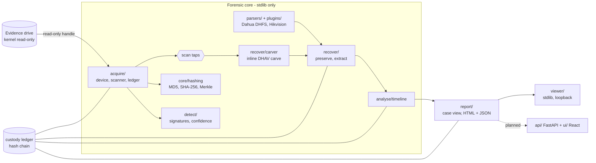

# System architecture

PS26150 deliverable: *system architecture documentation*. This describes the
system as built, not as planned; where something is planned it says so.

---

## 1. Constraints that shape everything

| Constraint | Consequence in the design |
|---|---|
| The evidence drive must never be written | No write path exists in the device layer; write blocking is layered (§4); plugins and the viewer never open a device themselves |
| Runs on an air-gapped forensic workstation | The forensic core imports only the Python standard library; the viewer needs no install; nothing calls the network |
| DVR drives are 1–4 TB and read over USB at 25–150 MB/s | Everything that needs the bytes happens in **one** read (§3); nothing re-reads the whole drive |
| Examiners have far less free disk than the drive holds | No full image by default: hashes of every block plus byte-exact copies of what matters, each provable against the drive (§5) |
| Eight named OEMs, media for two | Detection for all eight, parsers only where media exists, and a status on every claim (§6) |
| USB bridges fail mid-read | A lost device is never mistaken for bad sectors; the pass survives a reconnect only after re-verifying the drive (§4.3) |

---

## 2. Components



| Layer | Path | Responsibility |
|---|---|---|
| Device | `acquire/device.py` | Read-only access to a raw device or an image file; sector alignment; bad-sector isolation; device-loss detection; udev identity; write-block reporting |
| | `acquire/parallel.py` | Each tap in its own process, fed through a shared-memory ring; the hashes never leave the main process; a failing worker is recorded and the scan completes |
| Acquisition | `acquire/scanner.py` | The single pass: linear MD5 + SHA-256, per-block SHA-256 and Merkle root, signature scan, codec profile, taps, verified reconnect |
| Custody | `acquire/ledger.py` | Append-only JSONL; each entry carries the SHA-256 of the previous one |
| | `acquire/ewf.py` | E01 (EnCase) images read directly behind the same read-only device layer: segments, compressed and stored chunks, stored MD5/SHA-1 for self-verification |
| Integrity | `core/hashing.py` | Streaming hashes, Merkle root, inclusion proofs |
| Contract | `core/contract.py` | Frozen shapes (`SCHEMA_VERSION 1.0.0`) every engine builds against |
| Identification | `detect/` | Vendor signatures for all eight PS OEMs, confidence scoring, partitions; `survey.py` drafts an unknown disk's layout; `model.py` finds model numbers outside the video and checks them against the unit and the format |
| Parsing | `parsers/`, `plugins/` | Vendor filesystem plugins on one SDK with field provenance; drop-in loading |
| Recovery | `recover/carver.py` | Indexless DHAV carve: streams by byte contiguity and stream continuity; splits rather than guesses |
| | `recover/annexb.py` | Last resort for a vendor with no parser: raw H.264/H.265 anchored on parameter sets held to the standards' ranges; split at a new one or a gap |
| | `parsers/hikbtree.py` | Hikvision HIKBTREE index records from real media: camera and time per 1 GiB data block; labels carved PS streams |
| | `parsers/ext3.py` | Read-only ext2/ext3 (block maps; ext4 extents refused): a Linux recorder's own system files - HeimVision's event log and recording index |
| | `recover/pscarve.py` | Indexless MPEG-PS carve (Hikvision and others): packs accepted only when their packets end exactly on the next pack; dated from Hikvision `HK` descriptors |
| | `recover/preserve.py` | Filesystem metadata kept as whole scan blocks, provable to the Merkle root |
| Validation | `validate/exportmatch.py` | Recovered footage against the recorder's own export: picture slices compared in order, located by anchors that cannot repeat by chance |
| Analysis | `analyse/timeline.py` | Recorder clock → UTC on stated inputs; gaps; cross-camera correlation |
| | `analyse/activity.py` | Motion activity from P-frame sizes per camera per minute — a tap or a standalone pass; a lead, not evidence |
| Reporting | `report/` | One case view (`load_case`) for everything that presents a case; HTML + JSON report |
| Presentation | `viewer/` | Dependency-free local viewer over `load_case` |
| CLI | `cli.py` | Every capability; nothing is UI-only |

`docs/TECH_STACK.md` records the planned product UI (FastAPI in `api/`, React
in `ui/`). It wraps the same `report/case.py::load_case`, so the viewer and
the product UI cannot disagree about a case.

---

## 3. The single pass

Reading a 1 TB drive over USB 2 takes about nine hours, so a second full read
is not an option. `cli.py scan` reads the drive **once**, front to back, in
8 MiB blocks. Each block, in order:

1. feeds the running whole-drive MD5 and SHA-256;
2. gets its own SHA-256 — a leaf of the Merkle tree — written to `blockmap.jsonl`
   with codec and entropy statistics;
3. is searched for every vendor signature;
4. is handed to each **tap**. The carve tap (`--carve`) finds every validated
   DHAV frame, joins frames into streams, and labels each frame against the
   filesystem index read before the pass.

The block is then discarded. A 931 GB drive leaves about 30 MB of fingerprints
and a carve report behind.

A tap sees every byte the hashers see but cannot change a hash: if a tap
raises, the scanner switches it off, records that in the ledger, and the
acquisition carries on. The carve inside the pass was checked against a
standalone carve on real media: identical streams, extents, labels and root.

After the pass, everything else works from its outputs plus small targeted
reads: `preserve` reads a few MB of filesystem structures, `parse` reads the
index, `extract-carved` reads only the extents of the streams asked for.

---

## 4. Evidence safety

### 4.1 Write blocking, in layers

| Layer | Mechanism | Survives a USB reconnect? |
|---|---|---|
| Desktop | GNOME automount off; udisks2 stopped and masked | yes |
| Kernel | `blockdev --setro` on the whole device | **no** — reset on re-enumeration |
| udev | runtime rule keyed on the drive's serial, or on the evidence adapter's USB id, re-applies `--setro` at enumeration (`cli.py writeblock-rule`) | yes (until reboot) |
| Permission | read-only ACL for the examiner, so the scan can run without root | re-applied by the same rule |
| Process | the device is opened read-only; no write call exists in the code | — |

All of this is a **software** write block. The report says so; no hardware
blocker is claimed. `write_block_method` records the layer actually in force
(`software:kernel-setro+read-only-handle`), read from the kernel at the time.

The adapter-keyed rule refuses any adapter that holds a mounted filesystem, so
it can never make the workstation's own (USB-booted) disk read-only.

### 4.2 Plugins and the viewer cannot write

A parser plugin is handed an open read-only device; it never opens one, so a
third-party plugin cannot introduce a write path. The viewer has no route
that opens a block device and listens on 127.0.0.1 only.

### 4.3 Failure handling

| Event | What the device layer does |
|---|---|
| A sector will not read | Retry the block (1 s, 3 s, 9 s); then isolate the bad sectors one by one, zero-fill **only** those, report each |
| The device disappears, changes SCSI state, or its name now belongs to another disk | `DeviceLost` — never zero-filled |
| A read returns fewer bytes than asked, with no error | Treated as an error, never padded. (Found on real media: a dying bridge returned 6976 KiB of 8 MiB; the old code padded it into the hash.) |
| The device comes back | The scan waits (`--reconnect-wait`) for a device of the same size and serial that **is write-blocked**; re-reads block 0 and the last two blocks hashed; continues the same MD5/SHA-256 from the first unhashed byte only if all three match. Otherwise it refuses. |

Every loss, reconnect and refusal is a custody ledger entry and appears in
the report.

---

## 5. Integrity model

```
drive ──► linear MD5 + SHA-256          what every other tool compares against
      ──► SHA-256 per 8 MiB block ──► Merkle root
                                       │
   preserved block ── SHA-256 ── Merkle path ──┘   proves a kept block came from this drive
   carved clip ── extents ── blocks ── Merkle path  proves a clip's bytes came from this drive
```

- The **custody ledger** chains every action: device opened, scan started and
  completed (with the root), each tap's result, device loss and reconnect,
  metadata preserved, filesystem parsed, streams extracted, timeline built,
  report generated — each with the SHA-256 of the file it produced.
- `cli.py verify` re-walks the chain, recomputes the Merkle root from the
  block map, and re-verifies every preserved block against it.
- `cli.py prove --offset N` emits the inclusion proof for the block holding
  byte N.

A full forensic image is therefore optional rather than required: the
original drive stays sealed, and any byte extracted from it can be proven
against the hashes taken at acquisition.

---

## 6. Honesty model

| Mechanism | Where |
|---|---|
| Every vendor claim has a status — `validated`, `spec_only`, `synthetic_only`, `detected_not_parsed` — set by its **weakest** evidence | `detect/engine.py::_weakest`, `parsers/base.py::weakest_source` |
| Every decoded field records where its layout came from (fixture, published, observed on real media) | `parsers/base.py::FieldSpec` |
| Vendor attribution is a confidence score, never a boolean (CP Plus units carry Dahua DHFS) | `detect/engine.py` |
| Nothing is `validated` until footage is byte-matched against the recorder's own export | enforced by never emitting it; `validate-export` measures the match, and the status moves only in review |
| Recorder timestamps stay recorder-local unless the zone and clock error are stated, and the rule used is printed | `analyse/timeline.py::ClockModel` |
| Gaps are "no indexed footage", never "deleted"; carved footage outside the index has no camera | `analyse/timeline.py`, `recover/carver.py` |
| High-entropy regions are "detected, not parsed", never "encrypted" | `detect/engine.py` |
| Analytics are leads, not evidence — motion activity says so in its output, report and viewer | `analyse/activity.py` |

---

## 7. Extension points

| To add | Do this | Touches the core? |
|---|---|---|
| A vendor | one file in `plugins/` (copy `_template.py`): signatures + a `VendorParser` | no |
| An analysis during acquisition | a tap: `prepare(dev, start, end)`, `feed(offset, data)`, `finish(out_dir, info)` | no |
| A presentation | read `report/case.py::load_case` | no |
| AI analytics | optional `analytics/` layer (ONNX Runtime, ffmpeg — see TECH_STACK), reading extracted clips; never imported by the core | no |
| Reading the picture itself | same layer: `analytics/osd.py` needs only the `ffmpeg` and `tesseract` binaries. Keep the rules in `analytics/osd_rules.py`, which is stdlib-only so the core suite tests them | no |

---

## 8. Case directory

```
out/<case>/
  scan_report.json        hashes, Merkle root, detections, bad regions, stats
  case.jsonld             the case as CASE/UCO JSON-LD (case-export)
  model.json              model-numbered strings on the platter (identify-model)
  device_record.json      the recorder as read off the unit, photo hashes (record-device)
  blockmap.jsonl          one line per 8 MiB block: offset, SHA-256, statistics
  custody_ledger.jsonl    hash-chained record of every action
  codec_profile.json      where the H.264/H.265 payload lives
  oem_coverage.json       all eight PS vendors, detected or not
  regions.json            high entropy with no video structure (encrypted?), not parsed
  carve/carve_report.json streams, extents, index labels (scan --carve)
  carve/streams/          extracted footage (.dav + bare .h264/.h265)
  carve/extracted.json    per-file SHA-256 and frame checks
  carve/ps_labels.json    cameras for carved MPEG-PS streams, from a surviving HIKBTREE
  carve/annexb_report.json  raw H.264/H.265 streams (carve-annexb); es_streams/ when extracted
  validation/export_<clip>.json  recovered footage vs the recorder's own export
  analytics/analytics.json  faces and objects in extracted clips (optional layer)
  analytics/face_search.json  faces ranked by likeness to a reference photo: candidates
                          (optional layer); pictures in analytics/face_search/
  analytics/osd.json      camera titles and the clock read off the picture (optional layer)
  preserved/              filesystem metadata as whole scan blocks + manifest
  parse_<vendor>.json     volumes, recordings, field provenance
  timeline.json           events, gaps, correlations, anomalies, clock rule; the
                          recorder log's power and user events, and the power cuts
                          that explain silences on every camera
  hik_log.json            a Hikvision disk's own system log (hik-log)
  report.html, report.json
```
A combined view over several case directories (`cli.py combine`) writes
`combined.json` and `combined.html` to a directory of its own - it belongs to
no single case - and records itself in every source case's ledger.


---

## 9. Not built yet

Video decode to MP4 · Ed25519 report signing and RFC 3161 timestamping
(TECH_STACK two-stage plan) ·
FastAPI + React product UI.

Built since this section was written, and listed here only to say what is still
missing from them: AI analytics and the on-screen clock/title OCR both exist as
the optional `analytics/` layer, and both are now measured on real recorders'
footage (`VALIDATION_REPORT.md` §8a, §8c): both are leads, and the OCR is weak.
